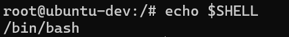

# Shell Scripting

## Ternminal

- Terminal is a program that provides a window that allows shell to run
- Terminal work as a repl. repl means read eval print loop

## Shell

Shell is a program/Command line interface, that acts as mediator between you and OS. It allows users to interact with an operating system.

### The Interaction Chain

- User: You type a command (like mkdir new_folder).
- Terminal (UI Program): Captures your keystrokes and sends them as text to the shell.
- Shell (Interpreter): This is the true mediator. It interprets the text you typed, checks if the command is valid, and then asks the Operating System (Kernel) to perform the action.
- Kernel (The Core): Carries out the task (creating the folder on the hard drive) and sends the result back up the chain.

## What is Shell Scripting?

Shell scripting is a series/sequences of shell commands in a file (a "script") to automate tasks.

### Why Shell Script is Used?

Shell scripting is primarily used for automation and system administration.

- Automating repetitive tasks:
  - Instead of manually backing up your files every day, you write a script to do it and schedule it to run automatically.
  - you may want to send a new userid and password to the developers every day and you automate it.
- System admin: Creating new user accounts, updating software, or monitoring system health.
- Batch processing: Creating/Renaming 1,000 files at once.

## What is Bash?

- Bash (GNU Bourne Again Shell) is a command line interpreter and scripting language for Unix-like systems (Linux, macOS).
- It allows you to interact with OS, automate tasks with script, manage files, run programs, etc.

## Check Shell Version

```bash
echo "$BASH_VERSION"
```

## Check Default Shell

```bash
$echo $SHELL
```



On Ubuntu `#!/bin/bash` is the default shell interpreter.

## Shenbag Line (#)

Every shell script begins with a shebang (`#!`), which tells the system which interpreter to use.

```bash
#!/bin/bash
#!/bin/sh
```
